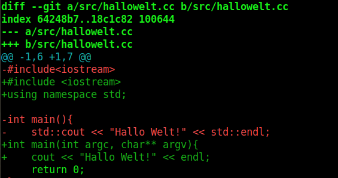
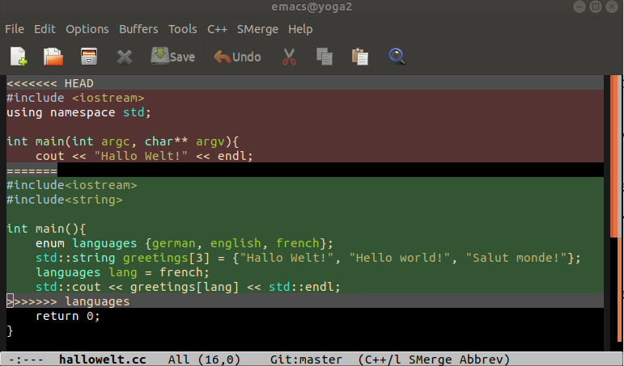
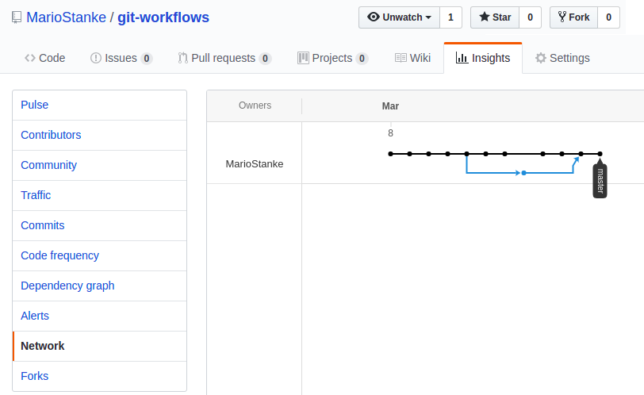

# Some Basics of Git

## 1) Create a new repository
 - Create an account on [GitHub](http://github.com)
 - Create a new project on GitHub (do **not** check box `README.md`), say, with name `ownProject`
 - Install git through package manager.
 - Configure git with `git config --global user.name "your name"` and `git config --global user.email "your-email-name@uni-greifswald.de"`  
 - Execute
 ```
mkdir ownProject
cd ownProject
echo "# my own project" > README.md
git init
git add README.md
git commit -m "initial commit"
git remote add origin https://github.com/YOUR-GH-NAME/ownProject
git push -u origin master
```
Do no forget to replace YOUR-GH-NAME with your GitHub account name.
 - Browse to [https://github.com/YOUR-GH-NAME/ownProject] to look at the GitHub repository of `ownProject`.

##  2) Create/edit files
For example, create a directory src under ownProject with files `src/hallowelt.cc` with content
```
#include<iostream>

int main(){
    std::cout << "Hallo Welt!" << std::endl;
    return 0;
}
```
and file `src/Makefile` with content
```
hallowelt: hallowelt.cc
	g++ hallowelt.cc -o hallowelt
```
Make sure there is only one tab and no spaces before `g++` in this makefile.

## 3) Make local commit
Add the two new files and their parent directory to the **staging area**, get a summary of the status of the local repository and commit the changes: In the parent directory execute
```
git add src
git status
git commit -m "Added Hallo Welt program"
```

Output of `git status`:
```
On branch master
Your branch is up to date with 'origin/master'.

Changes to be committed:
  (use "git reset HEAD <file>..." to unstage)

        new file:   src/Makefile
        new file:   src/hallowelt
        new file:   src/hallowelt.cc

Changes not staged for commit:
  (use "git add <file>..." to update what will be committed)
  (use "git checkout -- <file>..." to discard changes in working directory)

        modified:   README.md

Untracked files:
  (use "git add <file>..." to include in what will be committed)

        create-project.md
```
After the commit, only your local repository is changed. The remote repository on GitHub is unchanged.

## 4) Ignore files that do not need tracking

Building the project by issuing `make` in the `src` directory creates the binary file `hallowelt`, which should not be tracked. Files in the workspace that should not be tracked can be specified in a hidden file `.gitignore`. For example, create `ownProject/.gitignore` with the content
```
src/hallowelt
# ignore emacs backup files
*~
# ignore object files
*.o
```
Commit these changes with `git add .gitignore` and otherwise as in described in 2).

## 5) Create a branch
Suppose we wanted to add different language for the greeting in another branch. Do
```
git branch languages
```
creates a new branch `languages`, wich is identical to `master` for now. The list of (local) branches can be obtained with `git branch`:
```
  languages
* master
```
The * marks the current branch. Obtain all branches, including remote ones with `git branch -a`. One can change between branches with `checkout`. E.g.
```
git checkout languages
```
Make languages the current branch

Change `hallowelt.cc` like this

```
#include<iostream>
#include<string>

int main(){
    enum languages {german, english, french};
    std::string greetings[3] = {"Hallo Welt!", "Hello world!", "Salut monde!"};
    languages lang = french;
    std::cout << greetings[lang] << std::endl;
    return 0;
}
```

Indepently, the development can go on the master branch, e.g.
```
checkout master
```

Add command line arguments to `main` function and `using namespace std`
```
#include <iostream>
using namespace std;

int main(int argc, char** argv){
    cout << "Hallo Welt!" << endl;
    return 0;
}
```
and commit to master branch
```
git add src/hallowelt.c
```

Now we have two active branches with commited changes that are specific to the branch:
```
$ git log --all --graph --oneline

* 0a9025e (HEAD -> master) using namespace std
* 8a03ccf README.md
| * 3028bc7 (languages) new languages
|/  
* 5e873f2 created .gitignore file
* 59e8180 Added Hallo Welt program
* fd6fdae first commit
```

The hash values, that are used to identify a commit, are here abbreviated with the first 7 characters but the abbreviations can be used, e.g. 

```
$ git diff 5e873f2
```
compares the current commit (*HEAD*) with the commit 5e873f2 before the branch. The results could like this



To compare with the latest commit on the `languages` branch one would issue `git diff 3028bc7`.

## 6) Merge two branches

Suppose the language work has finished and we want to copy those changes into the master branch.
Since the branching, both the `master` and `languages` branch have changed and some of the changes
concerned the same lines (the line with `cout`). Although changes in different code lines are resolved automatically by `git`, we have to expect a conflict in this case.

```
git merge languages
Auto-merging src/hallowelt.cc
CONFLICT (content): Merge conflict in src/hallowelt.cc
Automatic merge failed; fix conflicts and then commit the result.
```

Open `src/hallowelt.cc` in an editor. The conflicts are marked like this:



The two versions in each conflict region of the code are enclosed by `<<<<<<<` and `>>>>>>>` followed by the commit or branch name. Simply edit this file to what it should be, e.g.
```
#include <iostream>
#include <string>
using namespace std;

int main(int argc, char** argv){
    enum languages {german, english, french};
    string greetings[3] = {"Hallo Welt!", "Hello world!", "Salut monde!"};
    languages lang = french;
    cout << greetings[lang] << endl;
    return 0;
}
```
build the project, perform the tests (if any) and add the files with resolved conflicts to the staging area before committing.

```
git add src/hallowelt.cc
git commit -m "merged languages into master"
```
Above commit is called a **merge commit**. In the network of commits, the 'languages' branch is now merged into the master branch which is the only active branch.
```
git log --all --graph --oneline
*   b3247d6 (HEAD -> master) merged languages into master
|\  
| * 3028bc7 (languages) new languages
* | 0a9025e using namespace std
|/  
* 5e873f2 created .gitignore file
```

Alternatively, GitHub -> Insights -> Network shows a graph of the branches and commits:


## 7) Push and pull - exchange between repositories

The remote repository on GitHub is called **origin** by default. 

To make the changes from your local master branch (current HEAD0 also in the `origin` repository on GitHub do
```
git push origin master
```
or short
```
git push
```

Here, `origin` and `master` are the name of the repository and branch to which to [push](https://git-scm.com/docs/git-push) the current branch of the local repository.

To incorporate changes (typically from other developers) that were made in the orign repository perform a so-called [pull](https://git-scm.com/docs/git-pull), e.g. from the master branch with

```
git pull origin master
```

This merges the changes that were made locally with the changes that were made remotely since the two branches diverged. It may require that *conflicts are resolved*.

## 8) pull request

Felix Becker or myself will review code in order to ensure quality. For this purpose, we will use *feature* branches. Suppose you have been assigned to implement a feature called *shortest-path*, have developed it on a local branch called `feature/shortest-path`, have built and tested it, finished this task and want to merge it into the `master` branch on GitHub.

```
git branch feature/shortest-path
git checkout  feature/shortest-path
git push origin feature/shortest-path # creates the branch remotely as well
[hours or days of work, local commiting and testing]
```
Browse to the *branches* tab of the project on GitHub and click "New pull request" for `feature/shortest-path`. Fill out a summary of what you did as a comment and click "Create pull request". This
will send Felix and me a message that we are requested to *pull* your changes to the master branch.
We will review the changes, give comments and possibly request changes. After possibly several rounds of requests and comments, eventually, we may merge the feature branch (here `feature/shortest-path`) into the `master` branch on `origin`.

## 9) Documentation in Markdown
This documentation is written in **Markdown** format. Similar to HTML-formatted files, such `.md` text files are displayed by GitHub (and other software such as `jupyter-notebook`) as a formatted document with highlighting, images and links. Information and examples are readily available on the internet, e.g. at http://markdown.de or https://www.markdownguide.org/basic-syntax.

It has become customary to document code on GitHub in Markdown with a file `README.md` that explains what the software does and how to install and run it.

## 10) References
1. Git, Dezentrale Versionsverwaltung im Team, Grundlagen und Workflows, Ren&eacute; Preißel, Bj&oslash;rn Stachmann, dpunkt.verlag, 4. Auflage
2. [Git Spickzettel](https://github.github.com/training-kit/downloads/de/github-git-cheat-sheet/)
3. https://git-scm.com/docs/gittutorial
4. https://git-scm.com/